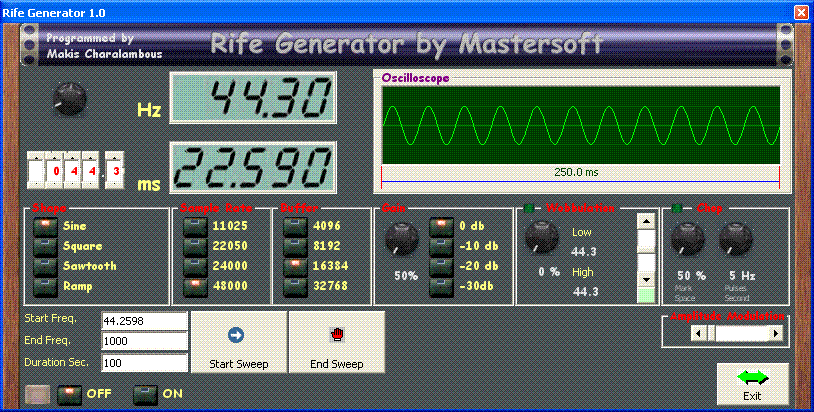



## msGenerator

### Description

This is a specialized precision generator that was asked from a friend of mine to be used with a Rife Machine (for cancer treatment). This is the very first version written over a weekend with the intention to refine it with saving a complete program with steps and several other ideas when time permits it. Only sine and square works in this version. You can set a beginning and ending frequency and how much time you need to span this range. Also you can add a fudge factor or wobbulation, extra amplitute modulation and optionaly a chopping modulation (to cool the Rife lamp and emulate original rife equipment). You can change the frequency manually with the thump switches or with the analogue frequency knob. I think the layout and what each button does is self explanatory. The wobbulation and Chopping are switched on/off with the green button on top of their respective frame. This is still very primitive but had to rush it out as functional without frills and whistles because my friend needed it yersterday.

You can ofcourse use the generator and/or change the code to suit your needs. I share this code in hope that someone might find it useful and if researching the Rife effect even use it for their experiments.

Take care, keep this site great for EVER and thanx for all the other contributors from who I stole :) a lot of code and ideas :)
 
### More Info
 

             |
---                |---
**Submitted On**   |2006-05-01 21:29:12
**By**             |[Makis Charalambous](https://github.com/Planet-Source-Code/PSCIndex/blob/master/ByAuthor/makis-charalambous.md)
**Level**          |Intermediate
**User Rating**    |5.0 (25 globes from 5 users)
**Compatibility**  |VB 6\.0
**Category**       |[Complete Applications](https://github.com/Planet-Source-Code/PSCIndex/blob/master/ByCategory/complete-applications__1-27.md)
**World**          |[Visual Basic](https://github.com/Planet-Source-Code/PSCIndex/blob/master/ByWorld/visual-basic.md)
**Archive File**   |[msGenerato199119512006\.zip](https://github.com/Planet-Source-Code/makis-charalambous-msgenerator__1-65171/archive/master.zip)

